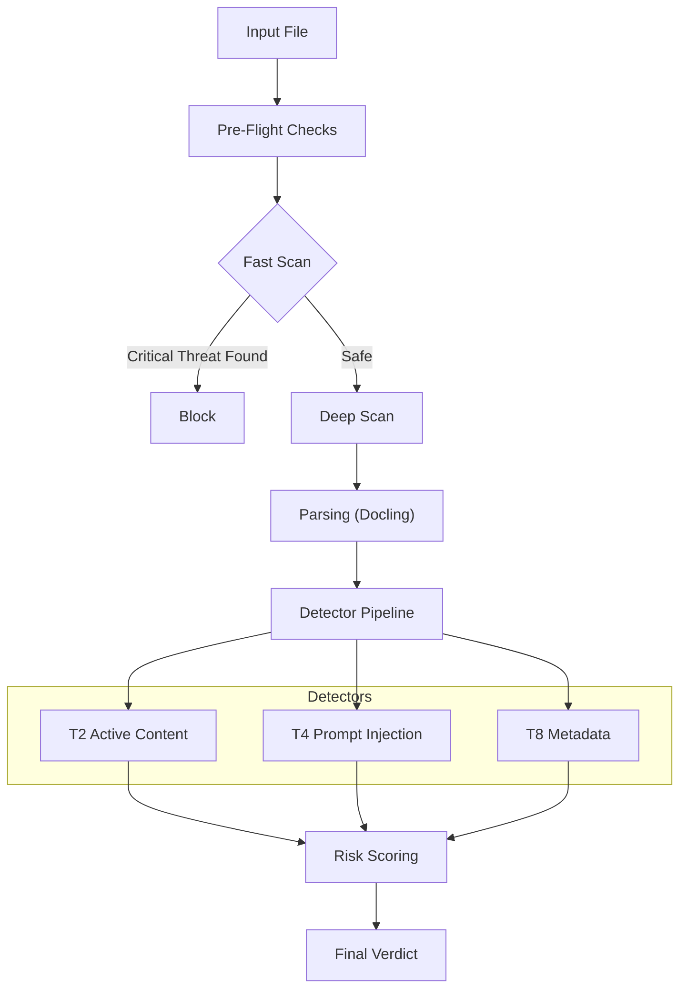

# Architecture

DocFirewall uses a pipeline architecture to process documents efficiently.

## 1. Input Interface
Documents enter via Python function calls (`scan()`), CLI, or REST API wrappers.

## 2. Pre-Flight
-   **Structure Check**: Verify PDF/DOCX magic bytes.
-   **Size Check**: Enforce `max_mb` limits.
-   **Hashing**: Compute SHA256 for caching/logging.

## 3. Fast Scan (Byte-Level)
Scans the raw binary stream without parsing the document structure.
-   **Speed**: < 20ms.
-   **Goal**: Reject obvious malware, zip bombs, or known signatures immediately.

## 4. Deep Scan (Parsed)
If the file passes Fast Scan, it is parsed into a standardized logical representation (text blocks, key-value metadata).
-   **Parsers**: `docling` (default), `pypdf`, `python-docx`.
-   **OCR**: Optionally enabled for scanned PDFs using RapidOCR.
