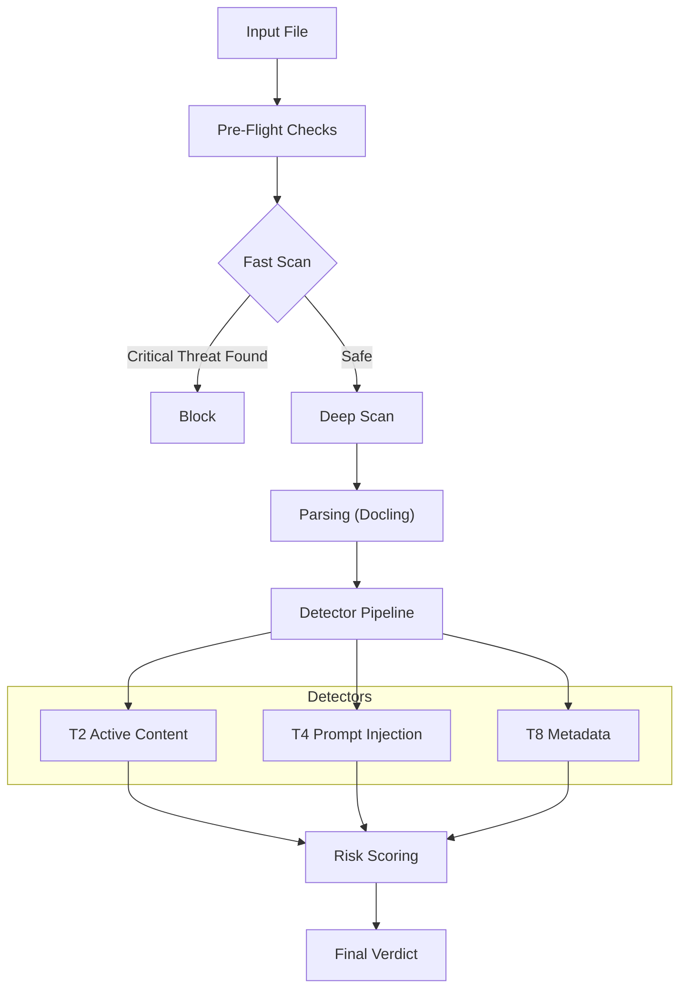

# Architecture

DocFirewall uses a pipeline architecture to process documents efficiently.

```mermaid
graph TD
    A["Input File"] --> B["Pre-Flight Checks"]
    B --> C{"Fast Scan"}
    C -->|"Critical Threat Found"| D["Block"]
    C -->|"Safe"| E["Deep Scan"]
    E --> F["Parsing (Docling)"]
    F --> G["Detector Pipeline"]
    
    subgraph Detectors ["Detectors"]
        H["T2 Active Content"]
        I["T4 Prompt Injection"]
        J["T8 Metadata"]
    end
    
    G --> H
    G --> I
    G --> J
    
    H --> K["Risk Scoring"]
    I --> K
    J --> K
    
    K --> L["Final Verdict"]
```

## 1. Input Interface
Documents enter via Python function calls (`scan()`), CLI, or REST API wrappers.

## 2. Pre-Flight
-   **Structure Check**: Verify PDF/DOCX/PPTX/XLSX magic bytes.
-   **Size Check**: Enforce `max_mb` limits.
-   **Hashing**: Compute SHA256 for caching/logging.

## 3. Fast Scan (Byte-Level)
Scans the raw binary stream without parsing the document structure.
-   **Speed**: < 20ms.
-   **Goal**: Reject obvious malware, zip bombs, or known signatures immediately.

## 4. Deep Scan (Parsed)
If the file passes Fast Scan, it is parsed into a standardized logical representation (text blocks, key-value metadata).
-   **Parsers**: `docling` (default, with OCR disabled — text-based PDFs only), `pypdf`, `python-docx`.
-   **OCR**: Not used by default. DocFirewall scans the text layer; OCR is not required for prompt injection or hidden-text detection.

## 5. Offline Intelligence (Zero-API Execution)
All processing—including obfuscation normalization (Layer 0), Aho-Corasick phrase matching (Layer 1, < 1 ms), regex fuzzy patterns (Layer 2, < 1 ms), sliding-window BERT sequence classification (Layer 3, ~50 ms with local DeBERTa weights), and optional semantic nearest-neighbour matching (Layer 4)—runs **strictly locally on CPU/GPU architecture**.
There are **zero external API calls**, protecting PII immediately by default and maintaining strict data residency compliance without relying on third-party services.
